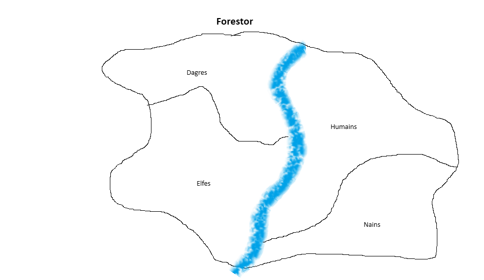

# Forestor

1. [Lore](#lore)
2. [Peuples](#peuples)
3. [Carte](#carte)
4. [Création de personnage](./01-Création%20de%20personnage.md)
5. [Règles]()
6. [Scénarios]()
   1. [Tutoriel](./50-Scénarios/01-Tutoriel.md)
   2. [XXXX]()

## Lore

Le jeu se déroule dans la plus grande région du continent, Forestor.  

Vous êtes de jeunes recrues de la grande guilde d'aventuriers de la capitale du royaume des Hommes, Yamanite.  
Vous avez été admis en même temps, mais ne vous connaissez pas encore vraiment.  
Le chef de guilde vous a affecté dans la même équipe et vous allez devoir faire vos preuves pour progresser dans l'organigramme de la guilde en commençant par des t^ches ingrates.  

### Guilde des aventuriers

**Rangs** : 
- **D**  
    Rang le plus bas de la guilde. La plupart des nouvelles recrues commencent à ce rang.  

- **C**

- **B**

- **A**

- **S**

### Peuples

Il est peuplé par les races suivantes : 
 - **Les Humains**   
    Le royaume est situé à l'est
    Caractèristiques : 
      - Débrouillard
      - Bonne relation economique et diplomatique avec les elfes et les nains
      - Métissé avec les elfes et les nains

    Capacités : 
      - Peut proter toute sorte d'aquipement et arme
      - Peut fuir avec 1  XXX en moins

 - **Les Dagres**   
    Leur territoire est situé au nord-ouest.    
    Ce sont des bêtes ayant évoluées jusqu'à être dotés d'une intelligence et d'une forme humanoïde.  
    - Redoutables dans leur environnement
    - N'entretiennent aucune relation avec les autres peuples, si ce n'est la guerre   

 - **Les Elfes**  
    Leur royaume est situé au sud-ouest.  
    - Très intelligent
    - Fragile physiquement
    - Posséde de la magie défensive et de renforcement musculaire gourmande en mana
    - Il trouvent les humains cupide

 - **Les Nains** 
    Leur royaume est situé au sud-est.  

## Carte

Une rivière traverse le pays du nord au sud séparant le royaume humain de celui des elfes et des Dagres.  

### Empire humain

### Royaume Elfe

### Royaume Nains

### Hordes de Dagres

## Système de jeu

